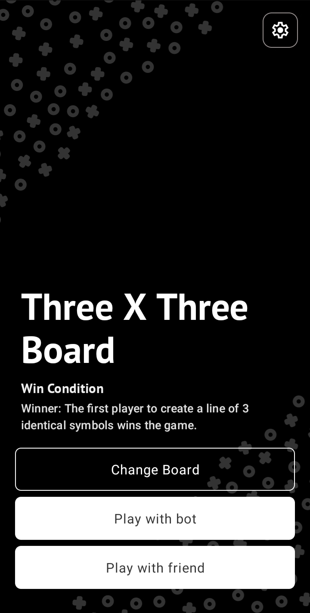

# Tic Tac Toe: Classic & Offline

**Tic Tac Toe: Classic & Offline** is a versatile Android game offering both single-player (against configurable AI) and local two-player modes on classic 3×3, 6×6, and 9×9 boards. It’s fully offline and features light/dark themes for personalized play.

The app is available for download on the Google Play Store:  

[](https://play.google.com/store/apps/details?id=com.ramphal.tictactoe)

---

## 📱 Features

- **Multiple Board Sizes**: Choose between 3×3, 6×6, or 9×9 grids for varied gameplay.
- **Single-Player vs AI**: Play against an AI opponent with adjustable difficulty levels.
- **Local Multiplayer**: Engage in two-player matches on the same device.
- **Offline Play**: Enjoy the game without any internet connection.
- **Theme Customization**: Switch between light and dark modes to suit your preference.

---

## 🖼️ Screenshots

<div style="display: flex; flex-wrap: wrap; justify-content: center;">
  
  
  
  
  
   
   
   
   
   
   
</div>

---

## 🚀 Installation

1. **Clone the Repository**

   ```bash
   git clone https://github.com/varuns18/Tic-Tac-Toe.git

## 🚀 Open in Android Studio

1. **Launch Android Studio.**
2. Click on `File` > `Open` and navigate to the cloned repository.

## ▶️ Build & Run

1. Connect an Android device or start an emulator.
2. Click on the `Run` button or use `Shift + F10`.

## 🎮 How to Play

1. **Select Board Size**: Tap on your preferred grid size (3×3, 6×6, or 9×9) from the main menu.
2. **Choose Game Mode**:
   - *Single Player*: Play against the AI.
   - *Two Player*: Play with a friend on the same device.
3. **Adjust AI Difficulty** (Single Player Mode):
   - Navigate to `Settings`.
   - Choose between Easy, Medium, or Hard difficulty levels.
4. **Start Playing**: Enjoy the classic game of Tic Tac Toe!

## 🧱 Architecture & Technologies

- **Language**: Java
- **Framework**: Android SDK
- **Architecture**: MVVM (Model-View-ViewModel)
- **UI Components**: AndroidX, ConstraintLayout
- **Persistence**: SharedPreferences for storing user settings
- **Design**: XML layouts with vector assets for scalable graphics

## 🤝 Contributing

Contributions are welcome! Please follow these steps:

1. **Fork the Repository**

   Click on the `Fork` button at the top right corner of the repository page.

2. **Create a Feature Branch**

   ```bash
   git checkout -b feature/YourFeature
   ```

3. **Commit Your Changes**

   ```bash
   git commit -m "Add YourFeature"
   ```

4. **Push to Your Branch**

   ```bash
   git push origin feature/YourFeature
   ```

5. **Create a Pull Request**

   Open a pull request from your forked repository's feature branch to the main repository's `main` branch.

For major changes, please open an issue first to discuss what you would like to change.

---

## 📄 License

This project is licensed under the [MIT License](LICENSE).

---

## 📬 Contact

- **Author**: Varun
- **GitHub**: [@varuns18](https://github.com/varuns18)
- **Website**: [Apple Guruhub](https://www.appleguruhub.com)
- **Play Store**: [Tic Tac Toe: Classic & Offline](https://play.google.com/store/apps/details?id=com.ramphal.tictactoe)
